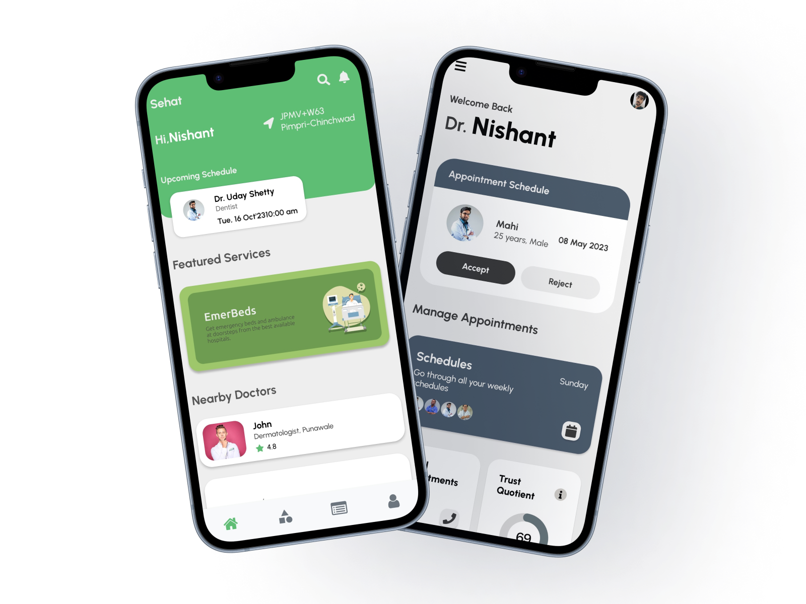

<div align="center">

<h1 align="center"><b>SEHAT</b></h1>

</div>

<div align="center"> 

 </img>
 </img>

</div>

<br>
<br>

# Context
SEHAT is a revolutionary healthcare app that brings personalized and accessible healthcare to patients. Utilizing advanced AI and ML algorithms, the app provides real-time access to medical resources, including doctor availability. Patients can upload diagnosis reports for priority scheduling and find the best available doctor based on location, cost, and distance. The app also offers emergency booking, teleconsultation, prescription refills, and the ability to engage with doctor communities. SEHAT combines healthcare and innovation to deliver an unparalleled patient experience.

<div align="center">
 
</div>
<br>
<b>SEHAT</b> is designed to provide comprehensive healthcare solutions. It offers features to prioritize patient well-being by combining cutting-edge technology and medical expertise. Users can access real-time medical information, schedule appointments, and connect with healthcare professionals seamlessly.

<br>
<br>
<br>

# Features
### 1. Personalized Healthcare:
<div>
SEHAT provides personalized healthcare solutions, ensuring individualized attention and care for each patient.
</div>

### 2. Priority Scheduling:
<div>
Patients can upload diagnosis reports for priority scheduling, ensuring quick and efficient healthcare services.
</div>

### 3. Teleconsultation:
<div>
SEHAT facilitates teleconsultation, allowing patients to connect with healthcare professionals remotely for medical advice and follow-ups.
</div>

### 4. Emergency Booking:
<div>
In emergencies, SEHAT offers quick and easy booking options to connect with medical professionals promptly.
</div>

### 5. Prescription Refills:
<div>
Patients can conveniently refill prescriptions through the app, streamlining the medication management process.
</div>

### 6. Doctor Communities:
<div>
SEHAT fosters a community where patients can engage with healthcare professionals, share experiences, and stay informed.
</div>

<br>
  
<div align="center"> 
   
  
  
  
  
   <br>
  
  
       
</div>

### Steps to run it
  <div>
   Step 1: Clone the repository
Firstly, you will need to clone the repository that contains the React Native project onto your local machine. You can do this by running the following command in your terminal:
   
```
   git clone <repository URL>
```
   </div>
  <br>
  <div>
   Step 2: Install dependencies
Once you have cloned the repository, navigate to the project directory and install the required dependencies by running the following command:

```
   npm install
```
  </div>
  <br>
  <div>
   Step 3: Run the project
After the installation of dependencies is completed, you can start the project by running the following command:
   
```
   npm start
```
  </div>
  <br>
  <div>
   Step 4: Run the app on an emulator or a physical device
To run the app on an emulator, open a new terminal window, navigate to the project directory, and run the following command:
   
```
   npx react-native run-android
```
  </div>
 <br>
   
### Download Application
Click [HERE](https://insightss.netlify.app) to check it out!

